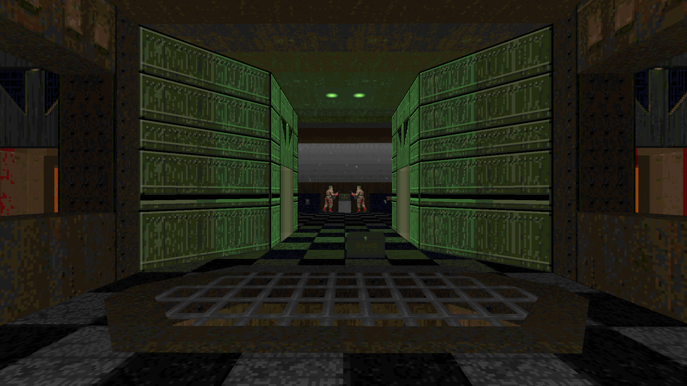
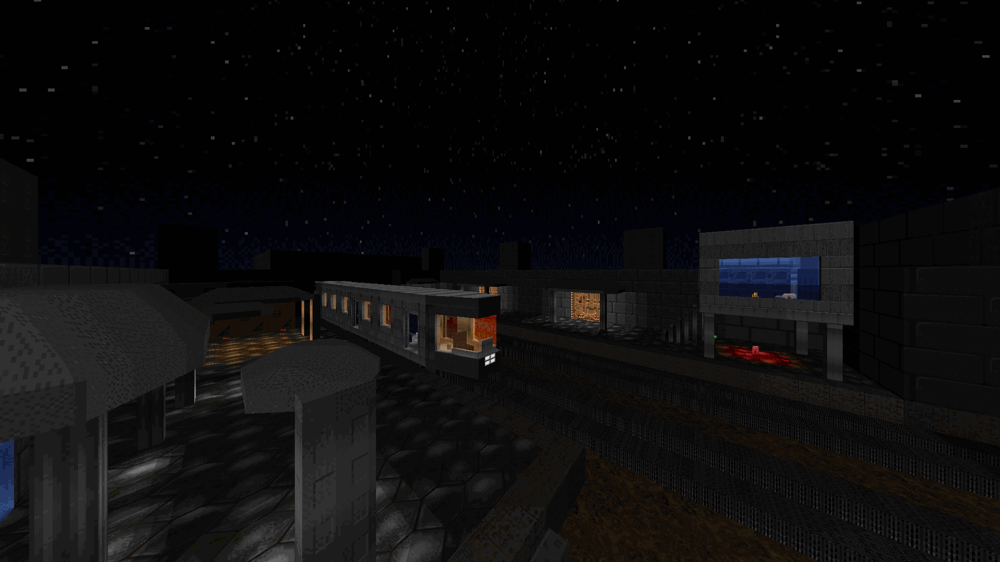
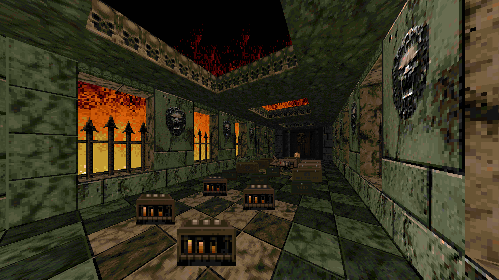

# DOOM PSX: Damnation of Eternity [1 Level, Eternity Engine 4.03 UDMF, DOOM 2]
## 🏆 ENDOOM Mapping Contest 2024 Modern Winner (Silver 🥈) 🏆

# STATUS: ✅RELEASED

The map was created in about 30 hours for the ENDOOM Mapping Contest 2024, where it won, taking 2nd place.

For detailed credit, see the CREDITS.TXT file.

This version is no different in gameplay and balance than the one in the contest archive with the exception of:
- DEMO is disabled in the menu
- Fixed interface, menu and weapon sprites (now correct aspect ratio)
- All compiled into a single .pke

The archive contains the project itself (.pke), a ready customized build of the required version of Eternity Engine 4.03 (Jan 4, 2024 build), readmys with detailed information in two languages and .bat for quick start (unzip and play).

Except that it will be necessary to drop doom2.wad in the folder with the port, or at the first launch specify your own folder with iwads

### Download - [Latest Release](https://github.com/dron12261games/WAD-DOOM-PSX-Damnation-of-Eternity-EMC2024/releases/download/v1.1/PSXDAMN.user-friendly.version.zip)

ENDOOM Mapping Contest 2024:
- Doom Power ([Contest itself](http://i.iddqd.ru/viewtopic.php?t=2492), [Results with maps](http://i.iddqd.ru/viewtopic.php?p=139482#139482))

# Screenshots:

